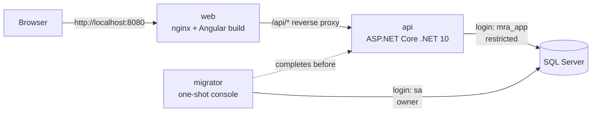

# Architecture — Maintenance Request & Approval System

**Status:** Draft v1
**Related:** [PRD](./PRD.md) · [Task Brief](./task-brief.md)

This document describes how the system is built. The PRD defines what the system does; it is not repeated here.

---

## 1. Technology stack

| Concern | Choice | Version / licence |
|---|---|---|
| Backend runtime | .NET, ASP.NET Core Minimal APIs | .NET 10 (LTS) |
| CQRS dispatch | MediatR | **12.5.0, pinned** (last Apache-2.0 release; 13+ is commercial) |
| Validation | FluentValidation | Apache-2.0 |
| Object mapping | **Manual mapping** (static mapping methods) | — |
| Data access | EF Core with SQL Server provider | EF Core 10 |
| Database | Microsoft SQL Server Developer edition (container) | 2022, pinned image tag |
| Auth | JWT bearer tokens; `PasswordHasher<T>` from `Microsoft.Extensions.Identity.Core` (PBKDF2) | — |
| API docs | Built-in `Microsoft.AspNetCore.OpenApi` + Scalar UI (Development only) | MIT |
| Frontend | Angular (standalone components, signals), no UI library | 22.x (latest stable) |
| Tests | xUnit, `WebApplicationFactory`, Testcontainers (MsSql) | Apache-2.0 / MIT |
| Local runtime | Docker Compose | Docker is the **only** prerequisite |

Why mapping is manual: free AutoMapper (14.x) has an unpatched high-severity DoS advisory (GHSA-rvv3-g6hj-g44x), and the patched versions are commercial. With about a dozen DTOs, hand-written mapping is short, checked at compile time, and easy to debug.

---

## 2. Repository layout

```
/
├── README.md              # how to run (the brief expects this at the root)
├── CLAUDE.md              # agent configuration (root)
├── backend/               # .NET solution
├── frontend/              # Angular app
├── infra/                 # docker-compose, env templates, setup scripts
└── docs/
    ├── task-brief.md
    ├── PRD.md
    ├── architecture.md
    ├── DECISIONS.md       # brief deliverable
    └── AI-LOG.md          # brief deliverable
```

`README.md` and `CLAUDE.md` stay at the root: reviewers look for the README there first, and agent tools such as Claude Code read `CLAUDE.md` from the repository root. All other documents, including `DECISIONS.md` and `AI-LOG.md`, go in `docs/`, and the README links to both.

---

## 3. System overview



- **One backend service.** This is the "1 microservice" requirement: a single deployable API with its own database.
- **Single origin.** nginx serves the Angular app and proxies `/api` to the backend. Because the browser only talks to one origin, no CORS configuration is needed.
- **Two database identities.** The migrator runs with owner rights. The API runs as a restricted login (see §8).

---

## 4. Backend — Clean Architecture

```
backend/
├── MaintenanceApprovals.slnx
├── Directory.Build.props         # nullable, warnings-as-errors, NuGet audit on
├── Directory.Packages.props      # central package versions (MediatR pinned 12.5.0)
├── Dockerfile                    # multi-stage: targets `api` and `migrator`
├── src/
│   ├── Mra.Domain/               # no dependencies
│   ├── Mra.Application/          # → Domain
│   ├── Mra.Infrastructure/       # → Application
│   ├── Mra.Api/                  # → Application, Infrastructure (composition root)
│   └── Mra.DbMigrator/           # → Infrastructure
└── tests/
    ├── Mra.Domain.Tests/
    └── Mra.Api.IntegrationTests/
```

Dependencies point inward only. Domain references nothing; Application references only Domain.

### 4.1 Domain (`Mra.Domain`)

- **Entities:** `Organisation`, `Site`, `User`, `MaintenanceRequest`, `AuditEntry`. Enums: `Role`, `RequestStatus`.
- **`MaintenanceRequest` is the aggregate root for the workflow.** State only changes through its methods: `Raise(...)`, `Approve(actor, now)`, `Reject(actor, comment, now)`, `Complete(actor, actualCost, now)`. There are no public setters for `Status`.
- **Transition table:** a single static map of allowed `from → to` transitions. Every method checks it and throws `InvalidTransitionException` for anything else. No state-machine library is used; five states don't need one.
- **Rules that belong to the domain:** the self-approval check (`actor.Id == RaisedByUserId` is rejected), the threshold routing (below the threshold is auto-approved, at or above goes to pending), the `ThresholdAtDecision` snapshot, and the overrun flag.
- **Audit entries are created by the aggregate.** Each transition method appends an `AuditEntry` to the request's `AuditEntries` collection. Because of this, a state change without an audit record isn't possible, and both are saved in the same `SaveChanges` call.

### 4.2 Application (`Mra.Application`)

Organised by feature, with one folder per use case:

```
Requests/
  CreateRequest/   CreateRequestCommand.cs, …Handler.cs, …Validator.cs
  ApproveRequest/  …
  RejectRequest/   …
  CompleteRequest/ …
  GetRequests/     GetRequestsQuery.cs, …Handler.cs
  GetRequestById/  …
  RequestMappings.cs      # manual: ToDto(this MaintenanceRequest r)
Reports/SpendBySite/
Admin/CreateOrganisation/, CreateUser/, CreateSite/, SetThreshold/
Sites/GetSites/
Auth/Login/
Common/
  Abstractions/  IAppDbContext, ICurrentUser, ITokenService, IPasswordHasher
  Behaviors/     ValidationBehavior
  Exceptions/    NotFoundException, ForbiddenException
```

- **CQRS:** commands change state and go through the domain aggregate. Queries read with `AsNoTracking()` and project straight to DTOs with `Select`, so reads never load entities they don't need. Reads and writes use the same database; a separate read store would be over-engineering at this size.
- **MediatR pipeline:** a single `ValidationBehavior` runs FluentValidation before the handler. Transactions don't need a pipeline behavior because each command commits with one `SaveChanges`, which is atomic.
- **`IAppDbContext`** exposes `DbSet`s directly to handlers. There is no repository layer. EF Core already provides unit-of-work and repository behaviour, and wrapping it would add code without adding isolation (see §11).
- **Manual mapping:** `ToDto()` extension methods for entity-to-response mapping, and `Select` projections in queries.
- **Time:** handlers use .NET's built-in `TimeProvider`, so tests can control the clock.

### 4.3 Infrastructure (`Mra.Infrastructure`)

- `AppDbContext`, with Fluent API configurations (one `IEntityTypeConfiguration` per entity), EF Core migrations, and the **tenant query filters** (§7).
- `SaveChangesInterceptor` for tenant stamping, the cross-tenant write guard, and the audit immutability guard (§7, §8).
- `CurrentUser`: reads `sub`, `org` and `role` from `HttpContext.User`. It never reads them from the request.
- `JwtTokenService` and `PasswordHasherAdapter`.

### 4.4 API (`Mra.Api`)

- Minimal API **endpoint groups** per feature. Each endpoint only sends a MediatR request and maps the result to an HTTP response.
- **Authorization policies** per role (`SystemAdmin`, `TenantAdmin`, `Requester`, `Approver`, `ApproverOrTenantAdmin`, `OrgMember`), applied to each group or endpoint. The fallback policy requires authentication, so any endpoint without an explicit policy is protected by default.
- **`IExceptionHandler` → ProblemDetails (RFC 9457):**

| Exception | Status |
|---|---|
| `ValidationException` | 400 |
| Authentication failure | 401 |
| `ForbiddenException` (for example, self-approval) | 403 |
| `NotFoundException` (includes other-tenant IDs) | 404 |
| `InvalidTransitionException`, `DbUpdateConcurrencyException` | 409 |

- The OpenAPI document and Scalar UI are enabled in Development only. They are the way to run the admin actions, since those are API-only.

### 4.5 DbMigrator (`Mra.DbMigrator`)

A one-shot console app that runs before the API starts. It:

1. Applies EF Core migrations using the owner login.
2. Idempotently creates the restricted `mra_app` login and user and applies its grants and denies (§8).
3. Idempotently seeds the System Admin from environment variables.

Keeping the migration step separate means the API never runs with rights to change the schema.

---

## 5. API surface

No route contains an organisation ID. The organisation always comes from the token.

| Method & route | Policy |
|---|---|
| `POST /api/auth/login` | Anonymous |
| `POST /api/admin/organisations` (creates the org and its first Tenant Admin) | SystemAdmin |
| `POST /api/org/users` | TenantAdmin |
| `POST /api/org/sites` | TenantAdmin |
| `PUT /api/org/threshold` | TenantAdmin |
| `GET /api/sites` | OrgMember |
| `POST /api/requests` | Requester, Approver |
| `GET /api/requests?status=` | Requester (own requests), Approver (all in org) |
| `GET /api/requests/{id}` | Requester (own), Approver |
| `POST /api/requests/{id}/approve` | Approver |
| `POST /api/requests/{id}/reject` | Approver |
| `POST /api/requests/{id}/complete` | Raiser or Approver |
| `GET /api/reports/spend?from=&to=` | ApproverOrTenantAdmin |

---

## 6. Data model

```mermaid
erDiagram
    Organisations ||--o{ Sites : has
    Organisations ||--o{ Users : has
    Organisations ||--o{ MaintenanceRequests : owns
    Sites ||--o{ MaintenanceRequests : "raised against"
    Users ||--o{ MaintenanceRequests : raises
    MaintenanceRequests ||--o{ AuditEntries : "history of"

    Organisations { uniqueidentifier Id PK; nvarchar Name; decimal ApprovalThreshold }
    Sites { uniqueidentifier Id PK; uniqueidentifier OrganisationId FK; nvarchar Name }
    Users { uniqueidentifier Id PK; uniqueidentifier OrganisationId FK "null = SystemAdmin"; nvarchar Email UK; nvarchar PasswordHash; tinyint Role }
    MaintenanceRequests { uniqueidentifier Id PK; uniqueidentifier OrganisationId FK; uniqueidentifier SiteId FK; uniqueidentifier RaisedByUserId FK; nvarchar Description; decimal EstimatedCost; decimal ActualCost; tinyint Status; decimal ThresholdAtDecision; bit ExceededThreshold; datetime2 CreatedAt; datetime2 CompletedAt; rowversion RowVersion }
    AuditEntries { bigint Id PK; uniqueidentifier OrganisationId; uniqueidentifier RequestId FK; uniqueidentifier ActorUserId "null = system"; nvarchar Action; tinyint FromStatus; tinyint ToStatus; nvarchar Comment; datetime2 OccurredAt }
```

**Key design points**

- **Money** is stored as `decimal(18,2)`. Timestamps are `datetime2`, always in UTC. Primary keys are GUIDs (`uniqueidentifier`), which can't be enumerated by guessing; the exception is `AuditEntries`, which uses a `bigint` identity so entries are strictly ordered by insertion.
- **The database prevents cross-tenant references.** `Sites` has an alternate key on `(Id, OrganisationId)`. `MaintenanceRequests` references it with a **composite foreign key** `(SiteId, OrganisationId)`. As a result, SQL Server itself rejects a request whose site belongs to a different organisation, even if the application has a bug. Users are handled the same way through `(RaisedByUserId, OrganisationId)`.
- **Concurrency:** `RowVersion` on `MaintenanceRequests` provides optimistic concurrency. If two Approvers act on the same request at once, the second save fails and returns 409.
- **Enums** are stored as `tinyint`, with check constraints on valid values.

**Indexes (chosen to match specific queries)**

| Index | Serves |
|---|---|
| `Users (Email)` unique | Login |
| `MaintenanceRequests (OrganisationId, Status, CreatedAt DESC)` | Approver list and pending filter |
| `MaintenanceRequests (OrganisationId, RaisedByUserId, CreatedAt DESC)` | Requester's "my requests" |
| `MaintenanceRequests (OrganisationId, Status, CompletedAt) INCLUDE (SiteId, ActualCost)` | Spend report, answered from the index alone |
| `Sites (OrganisationId, Name)` unique | Site list, no duplicate names within an org |
| `AuditEntries (RequestId, Id)` | History of one request |

**Migrations:** EF Core code-first migrations, committed to source control. Each schema change gets its own migration with a meaningful name. Migrations are applied only by `Mra.DbMigrator`.

---

## 7. Tenant isolation (defence in depth)

| Layer | Mechanism | What it stops |
|---|---|---|
| 1. Identity | The `org` claim is placed in the signed JWT at login. `ICurrentUser` reads only from claims. | A client choosing its own tenant |
| 2. API shape | No route or body field accepts an organisation ID. | ID-injection via parameters |
| 3. Reads | EF Core **global query filter** on every tenant-owned entity: `e.OrganisationId == currentUser.OrganisationId`. Applied centrally in `AppDbContext`. | A handler forgetting a `Where` clause |
| 4. Not-found semantics | A filtered-out row looks the same as a missing row, so the response is **404** rather than 403. | Probing whether another tenant's IDs exist |
| 5. Writes | `SaveChangesInterceptor` stamps `OrganisationId` on new tenant entities and throws if a modified entity's `OrganisationId` differs from the caller's. | Cross-tenant writes |
| 6. Database | Composite foreign keys (§6). | Inconsistent tenant data even when the app is bypassed |

**Why isolation is enforced mainly in the data-access layer:** that is the one place every query and write goes through. Per-endpoint checks rely on each developer (or agent) remembering them every time. The query filter is the default, and bypassing it requires writing `IgnoreQueryFilters()` explicitly.

**Allowed uses of `IgnoreQueryFilters()`:** only in the login handler (to look up a user by email before a tenant is known) and in System Admin handlers. The rule is written in `CLAUDE.md`, and every use can be found with a search.

**System Admin:** the account has `OrganisationId = null`, so the query filter returns no tenant data for it.

**How isolation is verified:** integration tests log in as an Org A user and send Org B IDs to every `{id}` endpoint. Each call must return 404, and the Org B data must be unchanged afterwards.

---

## 8. Audit integrity

1. **Created with the change:** the aggregate appends the entry in the same `SaveChanges` as the state change (§4.1).
2. **Append-only in code:** `AuditEntry` has no public setters and no update methods. The interceptor throws if any `AuditEntry` is in the `Modified` or `Deleted` state.
3. **Append-only in the database:** the API connects as `mra_app`. That user is granted `SELECT, INSERT, UPDATE, DELETE` on the application tables, and then **`DENY UPDATE, DELETE ON dbo.AuditEntries`**. Because `DENY` overrides grants, an application bug or a SQL injection can't rewrite the audit history.
4. **Who can still modify it:** only a database owner (the `sa` or migrator login), which the running application never uses. In production this would be a separate break-glass role; see §10.
5. **Verified by:** an integration test that opens a connection as `mra_app` and confirms that `UPDATE AuditEntries` fails.

A tamper-evident hash chain is listed as future scope.

---

## 9. Authentication & authorisation

- Login checks the password hash (PBKDF2 via `PasswordHasher<T>`) and returns a 60-minute JWT signed with HS256. The token carries the claims `sub`, `org`, `role` and `email`. There are no refresh tokens (future scope).
- The signing key, issuer and audience come from environment variables, and the app fails at startup if the key is missing or too short.
- **Server-side authorisation happens at three levels:**
  1. The endpoint's role policy.
  2. The handler's ownership rules (for example, a Requester can only read their own requests).
  3. The domain's invariants (self-approval, legal transitions).

  The Angular route guards and hidden buttons only improve the user experience; they are not a security control.
- Login failures return the same error whether the email or the password was wrong.

---

## 10. Secrets & configuration

| | Local (this repo) | Production (documented, not built) |
|---|---|---|
| Storage | `infra/.env`, **git-ignored**, generated by a setup script with random values | A managed secret store (for example, Azure Key Vault) injected at runtime |
| Committed | `infra/.env.example` with placeholder values only | — |
| DB credentials | `sa` used only by the migrator; `mra_app` used by the API | Managed identity or short-lived credentials, with the migrator run from the CI/CD pipeline |
| JWT key | Random 256-bit value in `.env` | Stored in the secret store, rotated, ideally asymmetric (RS256) |

---

## 11. Frontend

```
frontend/src/app/
  core/       auth.service.ts (token in sessionStorage, signals), auth.interceptor.ts,
              error.interceptor.ts (401 → login), auth.guard.ts
  features/
    login/
    requests/ request-list/, request-create/ (site dropdown), request-detail/ (approve/reject)
  shared/     api models (TypeScript interfaces matching the DTOs)
```

- The frontend uses standalone components, signals for state, reactive forms with validation that mirrors the server rules (the server remains the authority), and functional interceptors and guards.
- **Build:** a multi-stage Dockerfile builds the app with Node and serves it with nginx. The nginx config proxies `/api` to the backend and sets basic security headers (CSP, `X-Content-Type-Options`, `Referrer-Policy`).
- **Token storage trade-off:** the token is kept in `sessionStorage`, which is readable by JavaScript. This risk is reduced by the single-origin setup, the strict CSP, and the short token lifetime. HttpOnly cookie authentication is the stronger option and is listed as future scope.

---

## 12. Infrastructure & 15-minute setup

```
infra/
├── docker-compose.yml
├── .env.example
├── setup.sh / setup.ps1      # creates .env with random secrets if it doesn't exist
└── README fragment used by the root README
```

**Services, in start-up order:**

1. `sqlserver`: pinned `mssql/server:2022` image. Its health check uses `sqlcmd`, and data is kept in a named volume.
2. `migrator`: starts once `sqlserver` is healthy (`depends_on: service_healthy`), then exits.
3. `api`: starts once the migrator has finished successfully (`depends_on: service_completed_successfully`). Exposed on `localhost:5080` so Scalar is reachable.
4. `web`: nginx, exposed on `localhost:8080`.

**Reviewer flow:**

```
git clone … && cd infra
./setup.sh            # or .\setup.ps1 on Windows
docker compose up --build
```

**Known risk:** the SQL Server image is built for amd64 only. On Apple Silicon it runs under Docker Desktop's Rosetta emulation. The README will say this explicitly and give the Docker Desktop setting to enable.

---

## 13. Testing strategy

The goal is to test the risks the brief highlights, not to maximise coverage.

| Project | Type | What it covers | Why |
|---|---|---|---|
| `Mra.Domain.Tests` | Unit, fast | Every illegal transition is rejected; threshold routing at the exact boundary (equal to the threshold requires approval); self-approval blocked; overrun flag set | Core business rules, pure logic |
| `Mra.Api.IntegrationTests` | `WebApplicationFactory` + Testcontainers SQL Server | Cross-tenant ID manipulation returns 404 on every `{id}` endpoint; role policies return 403; spend report totals match a known dataset (range edges, zero-spend sites, other tenant excluded); the `mra_app` login cannot update or delete audit rows | Tenant isolation and audit integrity can only be proven against the real database |

Integration tests run against real SQL Server, not an in-memory provider. The query filters, composite foreign keys and `DENY` permissions are exactly what's being tested, and an in-memory provider would ignore all of them.

---

## 14. Alternatives considered and rejected

| Option | Why it was rejected |
|---|---|
| AutoMapper 14 | Unpatched high-severity DoS advisory; the fixed versions are commercial |
| MediatR 13+ | Commercial licence; 12.5.0 does everything needed here |
| Repository + Unit of Work over EF Core | Duplicates what EF Core already does and adds an extra layer without adding isolation |
| SQL Server Row-Level Security | Stronger isolation at the database level, but needs `SESSION_CONTEXT` set on every connection and is harder to debug. The composite foreign keys cover the integrity side. Kept as a future hardening step. |
| Separate read database or event sourcing for CQRS | Out of proportion to five tables and one service |
| Full ASP.NET Core Identity | Brings in about ten tables and UI flows we don't need; only its password hasher is used |
| Controllers | Minimal API endpoint groups are enough and have less boilerplate |
| FluentAssertions | Commercial from v8; the built-in xUnit asserts are sufficient |
| Database-per-tenant or schema-per-tenant | Operational overhead that isn't justified here; a shared schema with an `OrganisationId` discriminator plus the layers in §7 is enough |

---

## 15. Future scope (architecture)

SQL Server Row-Level Security · HttpOnly cookie authentication · refresh-token rotation · RS256 JWT with key rotation · audit hash chain · an audit read endpoint · a CI pipeline (build, test, NuGet/npm audit) · structured logging and tracing (OpenTelemetry) · rate limiting on login.
