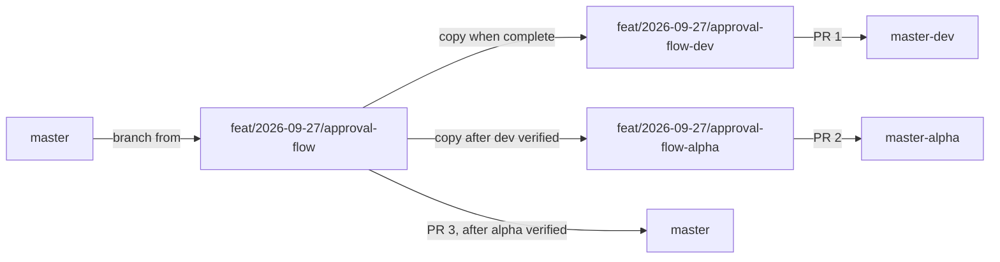

# Git Rules

**Applies to:** everyone who commits to this repository, human or AI agent.
**Agent summary:** see [§9](#9-rules-for-ai-agents). `CLAUDE.md` links to this file.

---

## 1. Branches

| Branch | Purpose | Deploys to | Direct push |
|---|---|---|---|
| `master` | Production. Always releasable. The **only** base for new work. | Production | ❌ Never |
| `master-alpha` | Pre-release. Verification before production. | Alpha / QA | ❌ Never |
| `master-dev` | Development and integration testing. | Dev | ❌ Never |
| Base work branch `{type}/{date}/{name}` | The actual change. This branch is the one that goes to production. | — | ✅ Owner only |
| Environment branches `…-dev`, `…-alpha` | Copies of the base branch, used only to get it into `master-dev` / `master-alpha`. | — | ✅ Owner only |

**Principle:** `master-dev` and `master-alpha` are **environments, not sources**. Code flows *into* them, but nothing is ever taken *from* them into a work branch or into `master`. Only the clean base branch, created from `master`, reaches production. As a result, unreleased or rejected work sitting in dev or alpha can never leak into production.

---

## 2. Lifecycle of a change



1. **Create** the base branch from `master`: `feat/2026-09-27/approval-flow`. All development happens here.
2. **When the feature is complete**, create `feat/2026-09-27/approval-flow-dev` from the base branch and open **PR 1 → `master-dev`**.
3. **Once it is verified on dev**, create `feat/2026-09-27/approval-flow-alpha` from the base branch and open **PR 2 → `master-alpha`**.
4. **Once it is verified on alpha**, open **PR 3 from the base branch → `master`**.
5. After each merge, delete the branch that was merged. The base branch is deleted after PR 3 is merged.

**Hotfixes** follow the same steps with the `hotfix` type. Skipping the dev or alpha stage in an emergency is a **human decision**, recorded in the PR description.

**If the base branch changes after an environment branch was created** (for example, after a review comment): commit the fix on the base branch, then merge the base branch into the existing `-dev` / `-alpha` branch and push. The open PR updates itself. Don't force-push, and don't recreate the branch.

---

## 3. Branch naming

```
{type}/{YYYY-MM-DD}/{short-kebab-description}[-dev|-alpha]
```

| Type | Use for |
|---|---|
| `feat` | New functionality |
| `fix` | Non-urgent bug fix |
| `hotfix` | Urgent production fix |
| `chore` | Tooling, dependencies, configuration, infrastructure |
| `docs` | Documentation only |
| `refactor` | Code restructuring with no behaviour change |
| `test` | Adding or changing tests only |

- **Every type is branched from `master`.**
- The date is the day the **base** branch was created. The `-dev` and `-alpha` copies keep the same date and name and only add the suffix.
- Use lowercase kebab-case, with no spaces or underscores. Keep the description to about 5 words.

**Examples**

```
feat/2026-09-27/request-approval-workflow          → PR to master
feat/2026-09-27/request-approval-workflow-dev      → PR to master-dev
feat/2026-09-27/request-approval-workflow-alpha    → PR to master-alpha
fix/2026-09-28/spend-report-date-range
hotfix/2026-10-02/cross-tenant-site-lookup
chore/2026-09-27/docker-compose-setup
```

---

## 4. Commits

Use the **Conventional Commits** format. The types match the branch types.

```
{type}({scope}): {imperative summary, ≤ 72 chars}

{optional body: what and why, not how}
```

- **Scopes:** `domain`, `app`, `infra`, `api`, `db`, `web`, `docker`, `docs`, `tests`.
- Each commit is **one logical change**, and the solution must build at every commit.
- All real work is committed on the **base** branch. Environment branches only receive merges (from the base branch, or from their target when resolving conflicts, see §6).
- Commit as you work. The history is evidence of the working process that reviewers will read, so don't batch a day of work into one commit.
- A migration goes in its own commit, named after the change it makes: `feat(db): add composite FK for request site tenant`.

**Examples**

```
feat(domain): enforce legal request state transitions
test(api): cross-tenant ID access returns 404
fix(app): treat estimated cost equal to threshold as requiring approval
chore(docker): add sqlserver healthcheck before migrator
```

**AI-assisted commits** keep the agent's co-author trailer (for example `Co-Authored-By: Claude <noreply@anthropic.com>`). This supports `docs/AI-LOG.md` and must not be removed.

---

## 5. Pull requests

**Every change reaches `master-dev`, `master-alpha` or `master` through a PR.**

| PR | From | Into | Opened when |
|---|---|---|---|
| PR 1 | `…-dev` | `master-dev` | The feature is complete, builds, and its tests pass |
| PR 2 | `…-alpha` | `master-alpha` | A human has verified the change on dev |
| PR 3 | base branch | `master` | A human has verified the change on alpha |

**Title:** use the Conventional Commits format, with the environment in brackets for PR 1 and PR 2 and the plan task ID at the end, for example `[dev] feat(api): approve and reject endpoints (T7.4)`.

**Description template** (to be committed as `.github/pull_request_template.md`):

```markdown
## What
<!-- one or two sentences -->

## Why
<!-- PRD / architecture reference, e.g. PRD FR-3, architecture §7 -->

## How it was verified
<!-- tests added or run, manual checks; for PR 2/3: link the earlier PR and say what was checked on that environment -->

## AI involvement
<!-- delegated fully / with constraints / by hand; anything the agent got wrong -->

## Checklist
- [ ] Builds and all tests pass locally
- [ ] No secrets, `.env` files or credentials in the diff
- [ ] New migration reviewed (if any)
- [ ] Tenant isolation / authorisation impact considered
- [ ] Docs updated if behaviour or setup changed
```

**Size:** aim for a PR that can be reviewed in about 15 minutes. Split larger work into several base branches.

**Merging**

- Always use a **merge commit**. Squash and rebase merging are disabled, because they would erase the commit history the brief asks to see.
- A **human** reviews, approves and merges every PR. An agent never does (§9).

---

## 6. Keeping branches up to date and resolving conflicts

| Situation | What to do |
|---|---|
| `master` moved ahead of your base branch | Merge `master` **into the base branch**. |
| PR 1 conflicts with `master-dev` | Merge `master-dev` **into the `-dev` branch** and resolve the conflict there. |
| PR 2 conflicts with `master-alpha` | Merge `master-alpha` **into the `-alpha` branch** and resolve the conflict there. |
| PR 3 conflicts with `master` | Merge `master` **into the base branch** and resolve the conflict there. |

**Never** merge `master-dev` or `master-alpha` into a base branch or into `master`. Doing so would pull other people's unreleased work into production, which is exactly what the environment-branch copies exist to prevent.

- **No force-pushes to any branch that has been pushed to the remote.** Updates are always made with merges.
- Conflicts are resolved on the work or environment branch, never on `master`, `master-alpha` or `master-dev`.

---

## 7. What must never be committed

- `.env` files, connection strings with real passwords, JWT keys, certificates, tokens.
- Build output (`bin/`, `obj/`, `dist/`, `node_modules/`) and IDE settings folders (`.vs/`, `.idea/`). These are covered by `.gitignore`.
- Only `.env.example` with placeholder values is committed.

**If a secret is committed:** stop, tell the human immediately, and rotate the secret. **Do not** try to rewrite history yourself, because rewriting history requires a force-push. Treat the committed secret as leaked even after it is removed.

---

## 8. Enforcement on GitHub (branch protection)

The rules above are guidance. These repository settings enforce them, applied to `master`, `master-alpha` and `master-dev`:

- Require a pull request before merging.
- Block force-pushes and branch deletion.
- Allow merge commits only (squash and rebase disabled).
- Require linear history: **off**. It conflicts with merge commits.
- Require status checks to pass: **enable once CI exists** (CI is future scope).
- Require approvals: **1** when there is more than one human on the team. On a solo repository, set it to 0; the rule that only a human merges (§9) is then the control.

---

## 9. Rules for AI agents

### The agent MAY

- Create base work branches **from `master`** using the §3 naming.
- Commit to its own base branch, following §4.
- Create the `-dev` copy of its base branch and open **PR 1 → `master-dev`** once the feature is complete, builds and passes its tests.
- Create the `-alpha` copy and open **PR 2 → `master-alpha`**, or open **PR 3 → `master`**, **only when the human says** the previous stage has been verified.
- Push its own work and environment branches.
- Merge branches into its own branches as allowed by §6 (for example `master` into the base branch, or the base branch into `-dev`).

### The agent MUST NOT

- **Approve, merge, or close a PR.** This means no `gh pr merge`, no `gh pr review --approve`, and no merge buttons.
- Push directly to `master`, `master-alpha`, or `master-dev`.
- Create a branch from `master-dev` or `master-alpha`.
- Merge `master-dev` or `master-alpha` into a base branch or into `master`.
- Force-push (`--force`, `-f`, `--force-with-lease`) to any remote branch.
- Rewrite shared history: no `rebase`, `reset --hard`, or `commit --amend` on commits that have already been pushed.
- Delete remote branches, or create or move tags.
- Skip hooks (`--no-verify`) or change branch protection or repository settings.
- Commit secrets or `.env` files, or remove the co-author trailer.

### Before every commit and PR, the agent must

1. Build the solution and run the tests. If they fail, fix the problem or report it; never commit failing code as if it passed.
2. Check `git diff --staged` for secrets and for unrelated changes.
3. Run `git branch --show-current` and confirm it is on a work or environment branch, never on `master`, `master-alpha` or `master-dev`.
4. Stop and ask the human if the task requires anything on the MUST NOT list.

### Harness enforcement (`.claude/settings.json`)

The following deny rules block the most common forms of the forbidden commands before they run:

```json
{
  "permissions": {
    "deny": [
      "Bash(gh pr merge:*)",
      "Bash(gh pr review:*)",
      "Bash(gh pr close:*)",
      "Bash(git push --force:*)",
      "Bash(git push -f:*)",
      "Bash(git push --force-with-lease:*)",
      "Bash(git push origin master:*)",
      "Bash(git push origin master-alpha:*)",
      "Bash(git push origin master-dev:*)",
      "Bash(git push --delete:*)",
      "Bash(git merge master-dev:*)",
      "Bash(git merge origin/master-dev:*)",
      "Bash(git merge master-alpha:*)",
      "Bash(git merge origin/master-alpha:*)",
      "Bash(git checkout -b * master-dev:*)",
      "Bash(git checkout -b * master-alpha:*)",
      "Bash(git reset --hard:*)",
      "Bash(git commit --no-verify:*)",
      "Bash(git tag:*)"
    ]
  }
}
```

The `git merge master-dev` / `master-alpha` rules also block the one legitimate case in §6: merging the target into a `-dev` or `-alpha` branch to resolve a conflict. **Conflict resolution on environment branches is therefore done by the human, or by the agent only after the human explicitly allows it for that case.**

Command-prefix deny rules can be bypassed by rearranging the command, for example putting flags in a different order. That is why these rules are one layer, and **GitHub branch protection (§8) is the backstop**: even if the agent runs a forbidden command, the remote rejects it.
