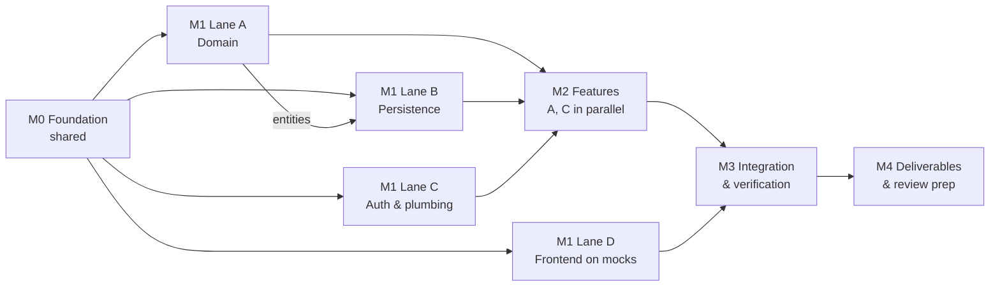

# Delivery Plan — Maintenance Request & Approval System

**Owner:** Senior Technical Project Manager
**Inputs:** [PRD](./PRD.md) · [Architecture](./architecture.md) · [Git Rules](./git-rules.md)
**Scope rule:** only what the PRD defines. Anything new goes to PRD §10 (Future Scope) and is **not** planned here. If something new seems essential, raise it with the PM before building it.

**How to use this document**

- Mark a task `[X]` only when it meets the [Definition of Done](#definition-of-done).
- Task IDs (for example `T2.3`) go at the end of PR titles and in `docs/AI-LOG.md` entries. Branch names follow the Git rules and do not include the ID.
- `{date}` in branch names is the date the branch is created (`YYYY-MM-DD`), as in the Git rules.

---

## 1. Team lanes

The plan assumes four developers. With fewer people, merge lanes; the dependencies stay the same.

| Lane | Developer | Owns |
|---|---|---|
| **A — Domain & Workflow** | Dev 1 | Domain model, request lifecycle, request features |
| **B — Data & Infrastructure** | Dev 2 | EF Core, migrations, tenant isolation mechanics, DbMigrator, Docker |
| **C — Platform & Admin** | Dev 3 | Auth, API plumbing, admin features, spend report |
| **D — Frontend** | Dev 4 | Angular app, nginx, web container |

---

## 2. Milestones and dependencies

**Critical path:** T0 → T1.1 (entities) → T2 → T6/T7 → T9 → T11 → T12.
Lane D is off the critical path because it builds against the API contract (T0.6) with mock data until M3.

---

## M0 — Foundation (blocks everything)

Owner: Dev 2 leads. T0.3, T0.4 and T0.5 can run in parallel once T0.1 is merged.

- [ ] **T0.1 Repository setup** · `chore/{date}/repo-setup`
  - [X] Create the folders `backend/`, `frontend/`, `infra/`, `docs/`.
  - [X] Add `docs/task-brief.md`, `docs/PRD.md`, `docs/architecture.md`, `docs/git-rules.md`, `docs/plan.md`.
  - [X] Add a root `.gitignore` (.NET, Node, `.env`, IDE folders) and `.editorconfig`.
  - [X] Add a root `README.md` stub.
  - [X] Create the `master`, `master-dev` and `master-alpha` branches.
  - [ ] Configure branch protection as described in Git rules §8.
  - [X] Add `.github/pull_request_template.md`.
- [X] **T0.2 Agent configuration** · `chore/{date}/agent-config`
  - [X] Write `CLAUDE.md`. It should link the architecture and Git rules documents and state the non-negotiable rules:
    - `IgnoreQueryFilters()` only in login and System Admin handlers
    - MediatR pinned at 12.5.0
    - manual mapping only
    - no new packages without approval
    - one `SaveChanges` per command
  - [X] Add `.claude/settings.json` with the deny rules from Git rules §9.
  - [X] Create `docs/AI-LOG.md` with a working-notes section. Every developer logs their prompts and agent mistakes here as they go.
- [X] **T0.3 Backend skeleton** · `chore/{date}/backend-skeleton`
  - [X] Create `MaintenanceApprovals.slnx` with `Mra.Domain`, `Mra.Application`, `Mra.Infrastructure`, `Mra.Api`, `Mra.DbMigrator`, `Mra.Domain.Tests` and `Mra.Api.IntegrationTests`.
  - [X] Add project references so dependencies only point inward.
  - [X] Add `Directory.Build.props`: nullable enabled, warnings as errors, NuGet audit on.
  - [X] Add `Directory.Packages.props` with pinned versions: MediatR 12.5.0, FluentValidation, EF Core 10, xUnit, Testcontainers.
  - [X] The empty solution builds and the empty test run passes.
- [X] **T0.4 Frontend skeleton** · `chore/{date}/frontend-skeleton`
  - [X] Create an Angular 22 app with standalone components and routing, and no UI library.
  - [X] Add `proxy.conf.json` so `/api` goes to the local API when using `ng serve`.
- [X] **T0.5 Infrastructure skeleton** · `chore/{date}/infra-skeleton`
  - [X] Add `infra/docker-compose.yml` with the `sqlserver` service: pinned image, `sqlcmd` health check, named volume.
  - [X] Add `infra/.env.example` with placeholder values only.
  - [X] Add `infra/setup.sh` and `infra/setup.ps1`, which generate `.env` with random secrets if it doesn't exist.
- [X] **T0.6 API contract** · `docs/{date}/api-contract` (Dev 3, parallel with T0.3–T0.5)
  - [X] Write `docs/api-contract.md` covering every route in architecture §5, with its request and response shapes and the ProblemDetails error format.
  - [X] Have Lanes A, C and D review and approve it. **After that, changes to the contract need agreement from all lanes.**

---

## M1 — Building blocks (parallel lanes)

### Lane A — Domain (Dev 1)

- [ ] **T1 Domain model** · `feat/{date}/domain-model`
  - [X] **T1.1** Add the entities `Organisation`, `Site`, `User`, `MaintenanceRequest` and `AuditEntry`, and the enums `Role` and `RequestStatus`. **Merge this first, because Lane B is waiting on it.**
  - [ ] **T1.2** Add the transition table: one static map of allowed `from → to` transitions.
  - [ ] **T1.3** Add `Raise()` with threshold routing (below the threshold → `Approved`; at or above → `PendingApproval`). On automatic approval, store `ThresholdAtDecision` (FR-4.2).
  - [ ] **T1.4** Add `Approve()` and `Reject()`, including the self-approval check and an optional comment on both (FR-3.4). `Approve()` stores the threshold in force at that moment as `ThresholdAtDecision` (FR-4.2).
  - [ ] **T1.5** Add `Complete()`, which takes the actual cost, sets `CompletedAt`, and sets `ExceededThreshold` when there is an overrun.
  - [ ] **T1.6** Make every transition method append an `AuditEntry`. `AuditEntry` has no public setters.
  - [ ] **T1.7** Add the domain exceptions: `InvalidTransitionException` (→ 409) and `SelfApprovalException` (→ 403).
  - [ ] **T1.8** Write unit tests:
    - every illegal transition is rejected
    - a cost exactly equal to the threshold requires approval
    - self-approval is blocked
    - the overrun flag is set
    - each transition creates exactly one audit entry

### Lane B — Persistence and tenant isolation (Dev 2; starts after T1.1)

- [ ] **T2 Persistence** · `feat/{date}/persistence-tenant-isolation`
  - [ ] **T2.1** Add `IAppDbContext` in Application and `AppDbContext` in Infrastructure.
  - [ ] **T2.2** Add entity configurations:
    - `decimal(18,2)` for money
    - `tinyint` enums with check constraints
    - `rowversion` on `MaintenanceRequests`
    - a unique index on `Users(Email)`
  - [ ] **T2.3** Add the alternate key `Sites(Id, OrganisationId)` and the **composite FK** `MaintenanceRequests(SiteId, OrganisationId)` to it. `RaisedByUserId` uses a plain FK (architecture §6).
  - [ ] **T2.4** Add the indexes listed in architecture §6.
  - [ ] **T2.5** Add the `ICurrentUser` abstraction and the **global query filters** on all tenant-owned entities.
  - [ ] **T2.6** Add a `SaveChangesInterceptor` that:
    - stamps `OrganisationId` on new tenant entities
    - blocks cross-tenant writes
    - blocks modifying or deleting any `AuditEntry`
  - [ ] **T2.7** Add the initial migration. **A human reads the generated SQL** before the PR is raised.
- [ ] **T2.8 DbMigrator** · `feat/{date}/db-migrator`
  - [ ] Apply migrations using the owner login.
  - [ ] Idempotently create the `mra_app` login and user, then add the grants and **`DENY UPDATE, DELETE ON AuditEntries`**.
  - [ ] Idempotently seed the System Admin from environment variables.

### Lane C — Auth and API plumbing (Dev 3)

- [ ] **T3 Platform** · `feat/{date}/auth-api-plumbing`
  - [ ] **T3.1** Register MediatR 12.5.0 and add a `ValidationBehavior` backed by FluentValidation.
  - [ ] **T3.2** Add the `IExceptionHandler` that maps exceptions to ProblemDetails (400, 401, 403, 404, 409) as in architecture §4.4.
  - [ ] **T3.3** Add JWT issuing and validation. The signing key, issuer and audience come from the environment, and startup fails if the key is missing or weak.
  - [ ] **T3.4** Add a `PasswordHasher<T>` adapter and a `CurrentUser` implementation that reads claims only.
  - [ ] **T3.5** Add authorization policies (SystemAdmin, TenantAdmin, Requester, Approver, ApproverOrTenantAdmin, OrgMember) and a **fallback policy that requires authentication**.
  - [ ] **T3.6** Add the OpenAPI document and the Scalar UI, enabled in Development only.
  - [ ] **T3.7** Add the login command and endpoint. It returns the same error whether the email or the password is wrong, and it is one of the allowed uses of `IgnoreQueryFilters()`.

### Lane D — Frontend on mocks (Dev 4)

- [X] **T4 Angular app** · `feat/{date}/frontend-core`
  - [X] **T4.1** Add the models from `docs/api-contract.md` and a mock API service that can be switched on or off.
  - [X] **T4.2** Add the core pieces: `AuthService` (token in `sessionStorage`, signals), an auth interceptor, an error interceptor (401 → login), and an auth guard.
  - [X] **T4.3** Add the login page.
  - [X] **T4.4** Add the request list page, with a status filter for Approvers.
  - [X] **T4.5** Add the create request page, with a site dropdown and form validation that mirrors the server rules.
  - [X] **T4.6** Add the request detail page. Approve and Reject are shown only to Approvers on pending requests that aren't their own; this is for the user experience only, since the server enforces the rules.
- [ ] **T4.7 Web container** · `chore/{date}/web-container`
  - [ ] Add a multi-stage `frontend/Dockerfile` (Node build, then nginx).
  - [ ] Add `nginx.conf`: SPA fallback, proxy `/api` to `api:8080`, and security headers (CSP, `nosniff`, `Referrer-Policy`).

---

## M2 — Features (parallel: Lane A and Lane C)

Every feature below consists of a command or query, a validator, a manual mapper, an endpoint with its policy, and its PRD reference.

### Lane C — Administration and report (Dev 3)

- [ ] **T6 Admin features** · `feat/{date}/admin-features`
  - [ ] **T6.1** `POST /api/admin/organisations`: creates an organisation and its first Tenant Admin in one `SaveChanges`. SystemAdmin only. (FR-2.2)
  - [ ] **T6.2** `POST /api/org/users`: creates a Requester or Approver in the caller's organisation. Email must be unique. (FR-2.3)
  - [ ] **T6.3** `POST /api/org/sites`: site names are unique within the organisation. (FR-2.4)
  - [ ] **T6.4** `PUT /api/org/threshold`: the value must be 0 or more. TenantAdmin only. (FR-2.5)
  - [ ] **T6.5** `GET /api/sites`: any member of the organisation. (FR-2.6)
- [ ] **T8 Spend report** · `feat/{date}/spend-report`
  - [ ] **T8.1** Validate that `from ≤ to`, with both dates inclusive and in UTC. (FR-6.2)
  - [ ] **T8.2** Sum `ActualCost` of `Completed` requests by site, including sites with zero spend. The grouping and summing must run in SQL. (FR-6.2, FR-6.3)
  - [ ] **T8.3** Add the endpoint with the ApproverOrTenantAdmin policy. (FR-6.1)

### Lane A — Request workflow (Dev 1)

- [ ] **T7 Request features** · `feat/{date}/request-workflow`
  - [ ] **T7.1** `POST /api/requests`: the site is looked up through the filtered query, so another organisation's site gives 404. Threshold routing is done in the domain. (FR-3, FR-4.1)
  - [ ] **T7.2** `GET /api/requests?status=`: Requesters see their own requests; Approvers see all in their organisation. Results are projected straight to DTOs. (FR-5.1, FR-5.2)
  - [ ] **T7.3** `GET /api/requests/{id}`: returns 404 for requests in other organisations and for other Requesters' requests. (FR-5.3)
  - [ ] **T7.4** `POST /api/requests/{id}/approve` and `/reject`: a `rowversion` conflict returns 409. (FR-3, FR-3.5)
  - [ ] **T7.5** `POST /api/requests/{id}/complete`: only the raiser or an Approver; the overrun flag is set by the domain. (FR-3, FR-4.4)

### Lane B — Containers (Dev 2, parallel with M2)

- [ ] **T5 Full compose stack** · `chore/{date}/compose-stack`
  - [ ] **T5.1** Add a multi-stage `backend/Dockerfile` with `api` and `migrator` targets.
  - [ ] **T5.2** Update compose so services start in order: `sqlserver` (healthy) → `migrator` (completed successfully) → `api` → `web`.
  - [ ] **T5.3** Confirm the API connects as `mra_app` and the migrator as the owner login, with credentials only from `.env`.

---

## M3 — Integration and verification

- [ ] **T9 Integration tests** · `test/{date}/integration-suite` (Dev 2 builds the test harness; Devs 1 and 3 write tests for their own features)
  - [ ] **T9.1** Build the test harness: Testcontainers SQL Server, `WebApplicationFactory`, the DbMigrator logic (including `mra_app`), and a test data builder for two organisations.
  - [ ] **T9.2** **Tenant isolation:** an Org A user calls every `{id}` endpoint with Org B IDs. Every call returns 404, and the Org B data is unchanged afterwards.
  - [ ] **T9.3** **Authorisation:** each policy returns 403 for the wrong role, and self-approval returns 403.
  - [ ] **T9.4** **Spend report:** totals match a known dataset, covering both edges of the date range, a site with zero spend, and the other organisation's data being excluded.
  - [ ] **T9.5** **Audit integrity:** `UPDATE` and `DELETE` on `AuditEntries` fail when connected as `mra_app`.
- [ ] **T10 Frontend integration** · `feat/{date}/frontend-live-api` (Dev 4)
  - [ ] Switch off the mocks and run against the real API through the nginx proxy.
  - [ ] Smoke-test the full flow: log in, create a request, approve it, reject one, and view the list as each role.
- [ ] **T11 Security and setup verification** (PM with Dev 2)
  - [ ] Search the code for `IgnoreQueryFilters`; it should appear only in the allowed places.
  - [ ] Scan the git history for secrets, and confirm `.env` is not tracked.
  - [ ] Confirm `dotnet list package --vulnerable` and `npm audit` are clean, or record any accepted issue.
  - [ ] **Clean-machine test:** fresh clone, setup script, `docker compose up`, working UI in **under 15 minutes**. Time it, and test on Apple Silicon if one is available.

---

## M4 — Deliverables and review preparation (PM with all developers)

- [ ] **T12 Documentation** · `docs/{date}/final-deliverables`
  - [ ] **T12.1** Complete the `README.md`:
    - prerequisites (Docker only) and the Apple Silicon Rosetta note
    - setup steps and the URLs
    - where the System Admin credentials come from
    - how to do the admin setup through Scalar
    - how to run the tests
  - [ ] **T12.2** Write `docs/DECISIONS.md` (one page): the key choices, what was rejected, and the assumptions (PRD §11). Include any gold-plating that was stopped.
  - [ ] **T12.3** Write `docs/AI-LOG.md` (one page) from the working notes. It must include:
    - what was delegated fully, what was delegated with constraints, and what was done by hand
    - at least one real prompt
    - one plausible-but-wrong agent output, with how it was caught
  - [ ] **T12.4** Check that the commit history is unsquashed and that PRs follow the Git rules.
- [ ] **T13 Review preparation**
  - [ ] Record the 2-minute walkthrough video.
  - [ ] Rehearse the likely deep-dive questions: where tenant isolation is enforced and why at that layer, audit integrity, the overrun decision, and what was delegated to the agent.
  - [ ] Do a practice run of a small live change request using the normal AI workflow.

---

## Definition of Done

A task can be marked `[X]` only when all of these are true:

- [ ] It meets its acceptance criteria and PRD reference.
- [ ] It builds with warnings as errors, and all tests pass.
- [ ] Tests were added where the task touches the risk areas in architecture §13.
- [ ] A PR was raised as described in Git rules §5, including the "AI involvement" section, and a **human** reviewed and merged it.
- [ ] Any agent mistakes found were logged in the `docs/AI-LOG.md` working notes.
- [ ] No scope was added beyond the PRD. Any new ideas were recorded in PRD §10.

---

## Open decisions

| # | Decision | Blocks | Owner |
|---|---|---|---|
| D-1 | An optional demo-data seed (two organisations with users and sites) so reviewers can try the UI without doing the admin setup through the API. **Not in the plan until approved.** | Nothing (T12.1 describes the manual admin setup if D-1 is declined) | PM |
